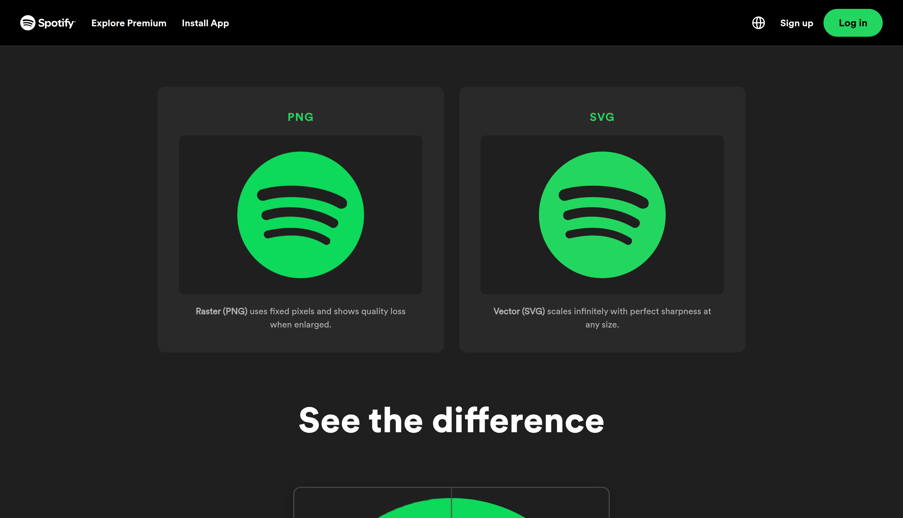
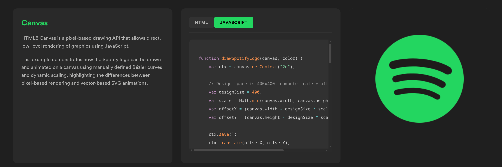
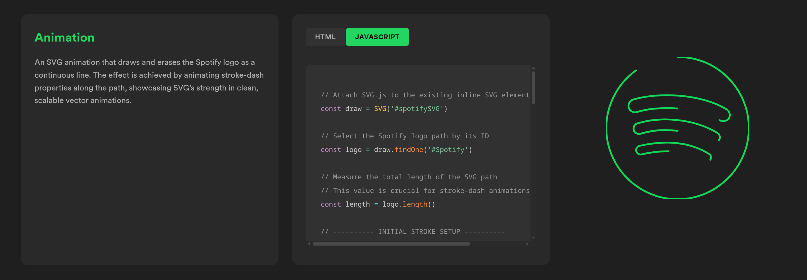
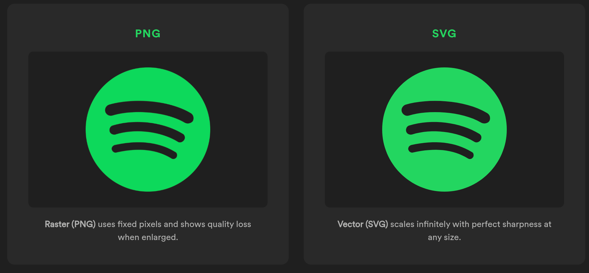

<h1 align="center">Spotify Bezier</h1>

<p align="center">
A Spotify-themed front-end showcase demonstrating PNG vs SVG rendering, canvas drawing of the Spotify logo using manual Bézier curves, an SVG.js stroke-dash "line draw/undraw" animation, and interactive code examples with HTML/JavaScript tabs. PNG and SVG comparison cards are downloadable on click.
</p>

---

### Table of Contents

- [Features](#features)
- [Screenshots](#screenshots)
- [Tech Stack](#tech-stack)
- [Project Structure](#project-structure)
- [Setup and Usage](#setup-and-usage)
- [Notes](#notes)
- [Author](#author)
- [License](#license)

---

## Features

- **PNG vs SVG Comparison Cards** – Side-by-side cards showcasing image formats; click to download assets instantly.
- **Canvas-Rendered Spotify Logo** – Manually drawn using Bézier curves with responsive scaling to fit any canvas size.
- **SVG.js Line Draw/Undraw Animation** – Continuous stroke-dasharray + dashoffset loop that draws and erases the logo path.
- **Code Example Panels** – Tabbed HTML/JavaScript code blocks with syntax highlighting and live preview panels.
- **Spotify-Inspired Dark UI** – Clean, dark-themed styling with responsive layout matching Spotify's design language.

---

## Screenshots


*Full page overview showing the comparison cards and example sections.*


*Interactive code example panels with HTML/JavaScript tabs and live preview.*


*SVG.js stroke-dash animation drawing and erasing the Spotify logo as a continuous line.*


*PNG and SVG comparison cards with hover effects; click to download.*

---

## Tech Stack

- **HTML5** – Semantic markup and accessibility attributes
- **CSS3** – Custom properties, grid layout, responsive design
- **Vanilla JavaScript** – DOM manipulation, clipboard API, download triggers
- **SVG.js** – Path animation via CDN
- **Coloris** – Inline color picker component

---

## Project Structure

```
spotify-bezier/
├── index.html
├── LICENSE
├── README.md
├── assets/
│   ├── spotify-png.png
│   ├── spotify-svg.svg
│   ├── overview.png
│   ├── examples.png
│   ├── line-draw.png
│   └── download-cards.png
├── js/
│   ├── app.js
│   ├── canvas.js
│   ├── animations.js
│   └── coloris.js
└── style/
    ├── styles.css
    ├── fonts.css
    └── coloris.css
```

---

## Setup and Usage

1. **Clone the repository**
   ```bash
   git clone https://github.com/your-username/spotify-bezier.git
   cd spotify-bezier
   ```

2. **Run a local server** (recommended for proper asset loading)
   ```bash
   # Using Python
   python -m http.server 8000

   # Using Node.js
   npx serve

   # Or use VS Code Live Server extension
   ```

3. **Open in browser**
   Navigate to `http://localhost:8000` (or the port shown by your server).

4. **Interact with the showcase**
   - Click PNG or SVG cards to download the assets.
   - Switch between HTML and JavaScript tabs in the code panels.
   - Watch the SVG line draw animation loop continuously.

---

## Notes

- The **SVG line draw animation** uses `stroke-dasharray` set to the path's total length and animates `stroke-dashoffset` from full length → 0 (draw) and 0 → negative length (undraw) in a loop.
- **PNG/SVG downloads** rely on the files existing at `assets/spotify-png.png` and `assets/spotify-svg.svg`. Ensure these are present for downloads to work.
- The **canvas logo** is drawn in a 400×400 design space and scaled/centered to fit any canvas dimensions.

---

## Author

**Maj Tobija Kodrič**

---

## License

This project is licensed under the MIT License. See [LICENSE](LICENSE) for details.
